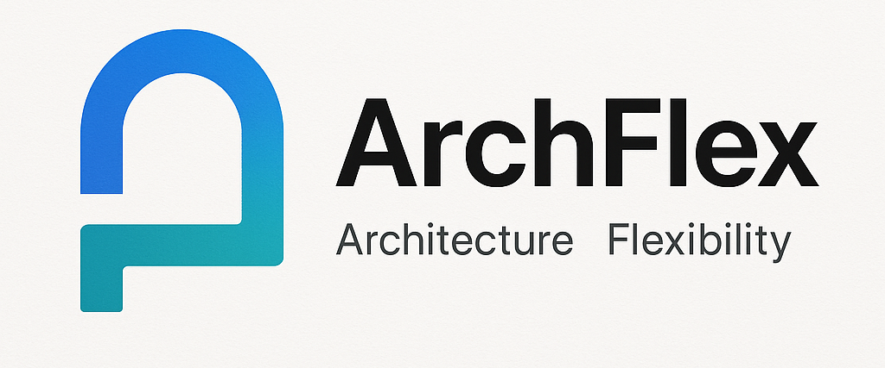
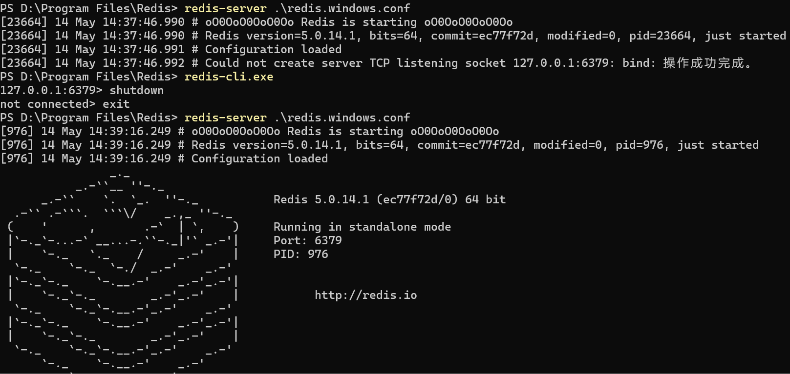

<h1 align="center" style="margin: 30px 0 30px; font-weight: bold;">ArchFlex v0.0.1</h1>
## 框架简介

Arch 代表架构（Architecture），Flex 代表灵活性（Flexibility）。这个框架具有高度的灵活性和可扩展性，能够适应各种不同的应用场景。

## 📄 1. 后端介绍
### 1.1 auth模块技术栈
Spring Security OAuth2

### 1.2 后端配置
JAVA版本：jdk1.8.0_321

Maven版本：apache-maven-3.9.9

MySQL版本：mysql-5.7.27-winx64

可视化工具：SQLyog

Redis版本：Redis-x64-5.0.14.1

- 启动Redis：在安装的Redis目录下执行 `redis-server .\redis.windows.conf`

- 出现问题：Could not create server TCP listening socket 127.0.0.1:6379: bind: 操作成功完成。

  - 原因：6379端口已绑定。应该是因为上次服务没有关闭

  - 解决：依次执行下面命令

    

后端启动顺序：Server --> ConfigServer --> Auth --> UserService --> Gateway  
其他服务（如Gen是代码生成服务、Message是消息服务）如果不需要可先不管，但注意Gateway服务是在所有服务启动后再启动


## 2. 前端介绍

Node版本：node-v16.20.2-x64

框架：Ant Design Vue Pro

- 项目地址：https://pro.antdv.com/
- 代码地址：https://github.com/vueComponent/ant-design-vue-pro

参考：[《基于YOLO+DeepSeek的农作物病虫害检测系统》](https://www.bilibili.com/video/BV1AaLizwEp8)

## 3. 开发日志  

Charts图表组件不生效：在 `src/core/lazy_use.js` 中

```
import Viser from 'viser-vue'
Vue.use(Viser)
```