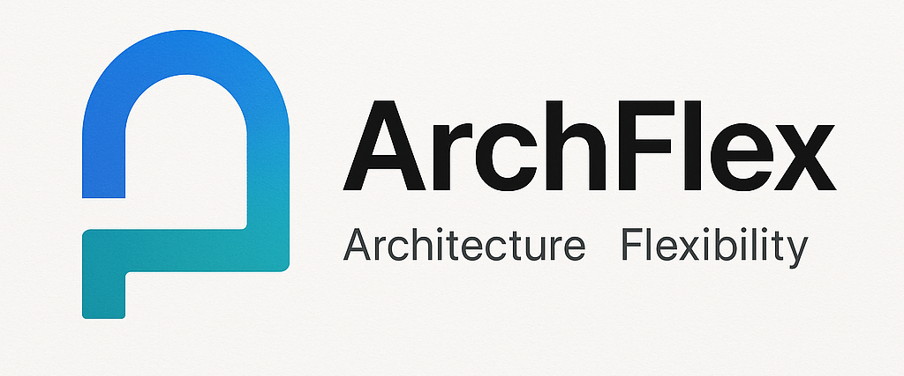
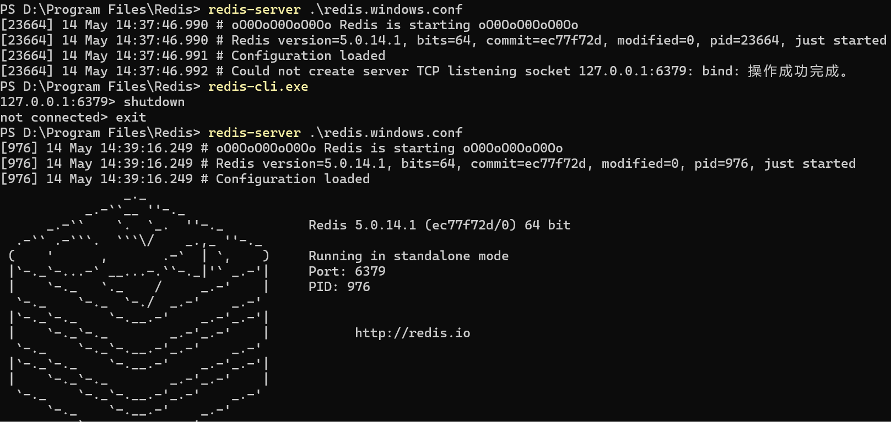

<h1 style="margin: 30px 0 30px; font-weight: bold; text-align:center;">ArchFlex v0.0.1</h1>

  

### 目录
- [框架简介](#框架简介)
- [后端介绍](#-1-后端介绍)
- [前端介绍](#-2-前端介绍)
- [开发日志](#3-开发日志)
  - [前端使用](#前端使用-)

## 框架简介

Arch 代表架构（Architecture），Flex 代表灵活性（Flexibility）。这个框架具有高度的灵活性和可扩展性，能够适应各种不同的应用场景。
- 后端采用Spring Boot、Spring Security、Redis & Jwt。
- 前端采用Vue、vue-pure-admin。

## 📄 1. 后端介绍
### 1.1 auth模块技术栈
Spring Security OAuth2

### 1.2 后端配置
JAVA版本：jdk1.8.0_321

Maven版本：apache-maven-3.9.9

MySQL版本：mysql-5.7.27-winx64

可视化工具：SQLyog

Redis版本：Redis-x64-5.0.14.1

- 启动Redis：在安装的Redis目录下执行 `redis-server .\redis.windows.conf`

- 出现问题：Could not create server TCP listening socket 127.0.0.1:6379: bind: 操作成功完成。

  - 原因：6379 端口已绑定。应该是因为上次服务没有关闭

  - 解决：依次执行下面命令

    

后端启动顺序：Server --> ConfigServer --> Auth --> UserService --> Gateway  
其他服务（如Gen是代码生成服务、Message是消息服务）如果不需要可先不管，但注意Gateway服务是在所有服务启动后再启动

## 📄 2. 前端介绍

Node版本：`^18.18.0 || ^20.9.0 || >=22.0.0`

框架：*vue-pure-admin*

- 项目地址：https://pure-admin.cn/
- 代码地址：https://github.com/pure-admin/vue-pure-admin
- [点我查看预览](https://pure-admin.github.io/vue-pure-admin)

前端本地部署参见：[README](./web/README.md#安装使用)

> 📝 **注意：** 请使用`pnpm`构建前端。

参考：[《基于YOLO+DeepSeek的农作物病虫害检测系统》](https://www.bilibili.com/video/BV1AaLizwEp8)

## 3. 开发日志

> [开发任务清单](https://www.yuque.com/u48948316/ztm8em/dcwacubn0gymxaaa)

### 前端使用  

  - 项目内图标的使用为按需引入，如若要添加请在 [echarts配置文件](./web/src/plugins/echarts.ts) 中添加
    > - 先从`echarts/charts`中引入
    > - 再在`use()`方法内添加
